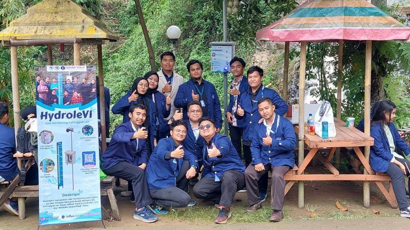

## Danke Hidayat – Computer Engineer and IoT Developer

Hi, I’m Danke Hidayat. I’m a Computer Engineering student at IPB University, based in Depok, Indonesia. I spend most of my time working with IoT systems, embedded programming, and network infrastructure. I enjoy building things that connect, measure, respond, and make life a little easier.

> *Even if I have to fight you, I won’t stop moving forward.*  
> — Maya Tendō (Revue Starlight)

## What I Work On

I like working at the point where hardware and software meet. Here’s what I focus on:

* **IoT and Embedded Systems:** Smart devices, sensors, microcontrollers, and real-time data work (ESP32, Arduino, Raspberry Pi).
* **Networking and Security:** CCNA and CCNP certified with experience in network setup, security basics, and IT infrastructure.
* **Full-Stack Development:** Web apps with Laravel, plus front-end work using HTML, CSS, JavaScript, and React.
* **Data and Cloud Tools:** Data processing with Google Sheets and cloud-based database setups.
* **Electronics Design:** Schematics, PCB layouts (Proteus & Fritzing), and hardware assembly for custom projects.

## Where I’ve Been

My work experience mixes hands-on engineering with analysis and testing:

* **Data Analyst and Software Tester** at PT. Global Kreatif Inovasi. I focused on data accuracy, app testing, and checking UI and UX details.
* **Assistant IT Officer** at Wyndham Hotel, handling infrastructure, security updates, RFID systems, and on-site support.
* **IoT Project Lead** for systems like an energy monitoring tool using **Mamdani Fuzzy Logic** and an automatic trash-sorting bin. Both combined hardware, software, and cloud dashboards (Blynk).

## Academic Work

At IPB University (current GPA: 3.57), I’ve taken part in several research and development projects, such as:

* Using fuzzy logic for real-time energy tracking and cost estimates.
* Designing web and mobile apps with the UCD method.
* Co-authoring papers on inventory systems, livestock tools, and environmental monitoring sites.

## How I Think

I’m a bit of a geek for tools like Vim, Linux, and anything open source. I enjoy tuning my setup until it fits how I work. My general approach looks like this:

* **Solve the real problem.**
* **Keep learning.**
* **Pay attention to the details.**
* **Work well with others**, whether that’s designers, developers, or clients.

## Outside of Tech

I’m learning Japanese, active in robotics groups, and work through online certifications like those from FreeCodeCamp. I also earned a **TOEIC score of 755**, which helps me collaborate comfortably in English.

## Let’s Connect

I’m always open to projects and conversations around IoT, embedded systems, or connected devices. If you want to build something or just talk ideas, feel free to reach out.
